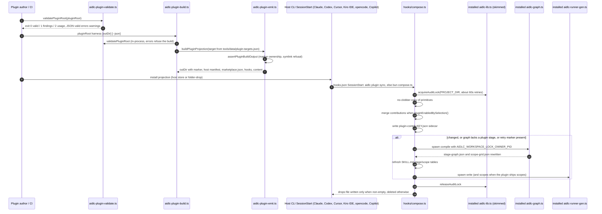
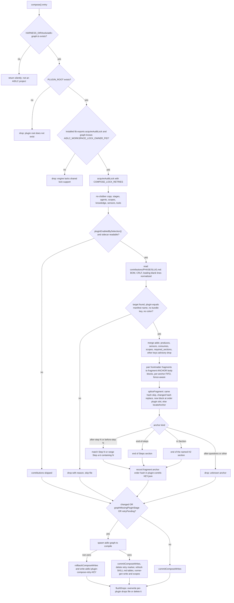
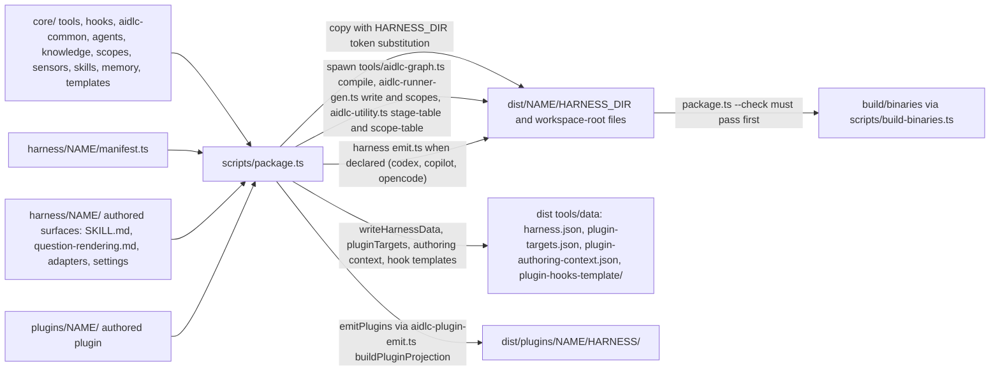

# Architecture — aidlc-workflows

> 深読み範囲はプラグイン機構に束縛した 13 パス（`reverse-engineering-timestamp.md` の `## Scope of Analysis`）。それ以外の要素（`aidlc-utility.ts`、`aidlc-lib.ts`、`core/hooks/`、stage-protocol など）は流し読みであり、図中では「skimmed」と明示する。各図の直下にテキスト・フォールバックを置く。

## Architecture Analysis

### System Overview

aidlc-workflows は「ハーネス中立のコア（`core/`）」を「ハーネスごとの配布ツリー（`dist/<harness>/`）」へ射影する **ビルド時射影型のモジュラーモノリス** である。実行時は各ユーザーのプロジェクトにコピーされた配布ツリー（`<harnessDir>/tools/*.ts`、`hooks/*.ts`、`aidlc-common/stages/*.md`）が bun 上で独立に動き、共有サービスやネットワーク依存を持たない。

プラグイン機構はこの射影パイプラインの延長として設計されている。プラグインの authored tree（`plugins/<name>/` または外部リポジトリ）を **同じ emitter**（`core/tools/aidlc-plugin-emit.ts`）でハーネスごとのホストプラグインへ射影し、**インストール先で** `hooks/compose.ts` がコアのステージ本文へ貢献をマージして `aidlc-graph.ts compile` を走らせる。合成結果はステージソース（Markdown）に永続化されるため、後続の graph compile を跨いで生き残る（`docs/reference/18-plugin-mechanism.md:160-163`）。

### Architectural Style

**モジュラーモノリス（ビルド時射影 + インストール時合成）**。根拠:

- 単一 dev パッケージ（`package.json`、`private: true`）から 7 配布ツリーを生成し、生成物を `dist/` にコミットして `--check` でバイト一致を強制する（`scripts/package.ts:31-36`、`.github/workflows/ci.yml:37-54`）。
- 実行時ツールは `node:*` 組込みと Bun API のみに依存し、プラグイン用ツールとテンプレートは依存ゼロを明示する（`core/tools/aidlc-plugin-validate.ts:2-6`、`core/tools/aidlc-plugin-emit.ts:1-6`）。
- ハーネス差分は manifest（宣言）と emit（手続き）に閉じ込め、コアは `{{HARNESS_DIR}}` トークン置換以外の変換を受けない（`scripts/package.ts:27-30`）。
- プラグイン合成は「一度の N-way マージ」であり、実行時はマージ済みソースを読むだけ（`docs/reference/18-plugin-mechanism.md:158-160`）。

### Component Relationships

```mermaid
flowchart LR
  subgraph authoring["Plugin authoring toolchain (offline, bundled in tools/)"]
    create["aidlc-plugin-create.ts"]
    validate["aidlc-plugin-validate.ts"]
    build["aidlc-plugin-build.ts"]
    emit["aidlc-plugin-emit.ts"]
    ptest["aidlc-plugin-test.ts"]
  end
  subgraph packager["Repository packager (dev checkout only)"]
    pkg["scripts/package.ts"]
    manifests["harness/NAME/manifest.ts"]
    hemit["harness codex, copilot, opencode emit.ts"]
    bins["scripts/build-binaries.ts"]
  end
  subgraph engine["Installed engine (dist/HARNESS copied into a project)"]
    graph["aidlc-graph.ts compile"]
    runner["aidlc-runner-gen.ts write / scopes"]
    includes["aidlc-includes.ts"]
    utility["aidlc-utility.ts plugin sync, select-plugins, doctor (skimmed)"]
    lib["aidlc-lib.ts lock and selection (skimmed)"]
  end
  subgraph hostplugin["Emitted host plugin (dist/plugins/NAME/HARNESS)"]
    compose["hooks/compose.ts"]
    launcher["hooks/aidlc-plugin-compose.ts (cursor, kiro-ide)"]
    wiring["hooks.json or .kiro/hooks/aidlc-NAME-compose.json"]
    content["stages, contributions, agents, scopes, sensors, tools, knowledge"]
  end
  create --> validate
  build --> validate
  build --> emit
  emit --> validate
  ptest --> build
  ptest --> compose
  ptest -. spawns .-> graph
  pkg --> manifests
  pkg --> hemit
  pkg --> emit
  pkg -. spawns in dist .-> graph
  pkg -. spawns in dist .-> runner
  hemit -. requires from dist .-> runner
  bins --> pkg
  emit --> compose
  emit --> launcher
  emit --> wiring
  emit --> content
  launcher --> compose
  wiring --> compose
  utility --> compose
  compose -. dynamic import .-> lib
  compose -. spawns .-> graph
  compose -. spawns .-> runner
  compose --> content
```
<!-- Text fallback: authoring tools (create -> validate; build -> validate + emit; emit -> validate; test -> build + compose + graph compile). Packager (package.ts) loads harness manifests and harness emit.ts, calls aidlc-plugin-emit.ts for plugin projections, and spawns aidlc-graph.ts compile / aidlc-runner-gen.ts inside the assembled dist tree; build-binaries.ts requires package.ts --check first. The emitted host plugin carries hooks/compose.ts (+ aidlc-plugin-compose.ts launcher for cursor/kiro-ide) and host hook wiring; compose dynamically imports the installed aidlc-lib.ts for the workspace lock, spawns aidlc-graph.ts compile and aidlc-runner-gen.ts, and is also driven by aidlc-utility.ts plugin sync. -->

コンポーネントごとの責務と依存は `component-inventory.md` に一度だけ記録する。

### Data Flow

1. **著作 → 検証**: プラグイン作者のツリー（`.aidlc-plugin/plugin.json` + `stages/` `contributions/` …）を `validatePluginRoot()` が読む。根拠データは同梱の `tools/data/plugin-authoring-context.json`（コアの agent 名・stage slug、`core/tools/aidlc-plugin-validate.ts:401-436`）。
2. **検証 → 射影**: `buildPluginProjection()` が `tools/data/plugin-targets.json`（7 ハーネスの `{harnessName, manifestDir, harnessLeaf, kind, installRoots}`、`aidlc-plugin-emit.ts:39-47,137-176`）に従い、`<outDir>` に所有マーカー `.aidlc-plugin-projection.json`、ホスト manifest（`aidlc-<name>`）、`marketplace.json`、`hooks/compose.ts`（＋ cursor / kiro-ide のみ launcher）、ホスト配線、`CONTENT_DIRS` のコピーを書く（`aidlc-plugin-emit.ts:74-82,290-322,324-418,421-458,595-660`）。
3. **射影 → インストール**: Claude / Codex / Cursor / opencode / Copilot はホストのプラグインストア、Kiro 系はフォルダドロップ（`docs/reference/18-plugin-mechanism.md:146-150`）。
4. **インストール → 合成**: SessionStart フックが `aidlc plugin sync`（`aidlc` バイナリがあるとき）または `bun <root>/hooks/compose.ts` を実行（`aidlc-plugin-emit.ts:324-351`）。compose はワークスペースロックの下で (a) プラグインの primitives を no-clobber コピー、(b) 選択で有効なら `contributions/` をコアステージのソースへマージ、(c) 実際に適用した構造要素と fragment `{anchor, order, hash}` を `tools/data/plugin-contrib-<key>.json` に記録、(d) `changed` / グラフ欠落 / 再試行マーカーのいずれかで `aidlc-graph.ts compile` → SKILL.md の生成表更新 → `aidlc-runner-gen.ts write`（スコープがあれば `scopes`）を走らせる（`compose.ts:1945-1960,2012-2034,2310-2325,2376-2433`）。
5. **観測**: 落とした貢献は `<hooksHealthDir>/plugin-compose-<key>.drops` に「今回の実行の完全な記録」として上書きされ、0 件なら削除される（`compose.ts:191-227`）。doctor はこれと sidecar を読む（`docs/reference/18-plugin-mechanism.md:164-172`）。

### Interaction Diagrams

**トランザクション 1: validate → build/emit → install → compose/sync → recompile**


<!-- Text fallback: the author runs validate (exit 0/1/2), then build which re-validates in-process and calls the emitter with the target record from plugin-targets.json; the emitter asserts output ownership and writes marker, host manifest, marketplace.json, hooks and content. The projection is installed through the host store or folder-drop. On SessionStart the host runs `aidlc plugin sync` or `bun compose.ts`; compose acquires the workspace lock via the installed aidlc-lib.ts, copies primitives no-clobber, merges contributions only when enabled by selection, writes the contribution sidecar, and (when something changed, a plugin stage is missing from the graph, or a retry marker exists) spawns aidlc-graph.ts compile under the inherited lock, refreshes SKILL.md tables and runs aidlc-runner-gen.ts write/scopes; then it releases the lock and overwrites or deletes the per-plugin drops file. -->

**トランザクション 2: compose 内部の貢献マージと再コンパイル契機**


<!-- Text fallback: compose returns silently when the harness has no tools/aidlc-graph.ts; drops when PLUGIN_ROOT is missing or the installed engine lacks lock support; acquires the workspace lock; copies primitives no-clobber; when the plugin is enabled by selection and the sidecar is readable it parses each contribution (normalizing BOM/CRLF/leading blanks), rejects files whose target is missing, whose plugin differs from the manifest name, that use the dead `bundle:` key, or whose plugin contains a colon; merges the five implemented adds surfaces (others are advisory drops); pairs frontmatter fragments to `## fragment:` blocks per anchor FIFO with a fence-aware scanner; splices with sentinel hashing (skip / replace / insert at (order, plugin) / locateAnchor for a virgin anchor); locateAnchor supports after-step:N and before-step:N (range headings count), end-of-steps, in:<Section>, and drops `after-questions` as unknown; records applied fragments in the sidecar; recompiles when changed, when a plugin stage is missing from the graph, or when a retry marker exists; on compile failure it rolls back and writes the retry marker, on success it commits, refreshes SKILL.md tables and regenerates runners; finally it overwrites or deletes the per-plugin drops file. -->

**トランザクション 3: dev リポジトリの packager パイプライン**


<!-- Text fallback: package.ts reads core/, each harness manifest and authored surfaces, and each plugins/<name>/; it copies with {{HARNESS_DIR}} substitution into dist/<name>/, spawns the in-tree graph compile, runner generation and stage/scope table refresh, runs the harness emit.ts when declared, writes tools/data (harness.json, plugin-targets.json, plugin-authoring-context.json, the bundled hook templates), and emits dist/plugins/<name>/<harness>/ through the same emitter the standalone builder uses; build-binaries.ts refuses to run unless package.ts --check passes. -->

### Key Design Decisions

観測された設計判断を、コード内コメントと文書に残る根拠・代替案とともに記す（Reverse Engineering であるため「採用されている判断」の記録であり、新規の ADR ではない）。

| # | 判断 | 根拠（file:line） | 記録されている代替案・却下理由 | 帰結 |
|---|---|---|---|---|
| D1 | **インストール時合成**（SessionStart で compose、実行時はマージ済みソースを読む） | `docs/reference/18-plugin-mechanism.md:27-43,144-160` | 実行時オーバーレイ（毎セッションのマージ）は退けられ、「runtime stays read-only with respect to composition」 | graph compile を跨いで永続、ただしエンジン再インストールで消えるため `plugin sync` の再実行が必要（`18-plugin-mechanism.md:161-172`） |
| D2 | **貢献は厳密に追加のみ**、構造は集合和、prose は anchor スプライス | `18-plugin-mechanism.md:22-25,356-362`、`compose.ts:1575-1600,2153` | 上書き（last-writer-wins）は「genuine conflict は attribution 付きの compose error」として却下 | 独立作者間で可換。`lead_agent` 変更や `required` 緩和は不可能 |
| D3 | **sentinel に内容ハッシュを埋め込む**（`<!-- plugin:<p>:<anchor>:<order>:<fnv1a> -->`） | `compose.ts:1716-1760` | 見出し境界でブロックを判定する方式は「Never relies on the next heading to bound a block」として却下；ハッシュなし close marker は round-5 で置換 | 冪等、アップグレード時の置換、`(order, plugin)` による決定的並び |
| D4 | **fragment の対応は anchor ラベルで per-anchor FIFO**、fence-aware スキャナ | `compose.ts:2232-2270` | 配列位置による対応（round-4 で誤対応）、グローバル正規表現（round-5 で code fence 内を誤検出）を却下 | 同一 anchor 複数 fragment が可能（test-pro の `after-step:8` ×3） |
| D5 | **compose は単一 TS ファイル・依存ゼロ・インストール先 lib を動的 import** | `compose.ts:2-9,103-115` | shell + 2 TS の三点セット（GNU `sed -i`、BSD `cp -rn` の移植性バグ）を却下 | フレームワーク checkout に依存しない。lib / schema が読めないと **fail-open**（`compose.ts:397-417,1405-1413`） |
| D6 | **drops ファイルは今回実行の完全記録として上書き、0 件で削除、プラグイン別** | `compose.ts:203-227` | 追記方式（無限成長）、共有ファイル（最後のプラグインが他の drop を消す round-6）を却下 | doctor が「生きた信号」を読む |
| D7 | **manifest を単一情報源とし、`plugin-targets.json` を出荷して standalone builder が読む** | `scripts/package.ts:1036-1075`、`aidlc-plugin-emit.ts:1-6,137-176`、`scripts/manifest-types.ts:150-171` | packager と builder が別ロジックを持つ案は「The checkout packager and shipped builder call the same emitter」で却下 | 新ハーネスは manifest 追加だけで既定の射影を得る |
| D8 | **選択は `harness.json` の `plugins` キー**、キー不在は全有効 | `compose.ts:274-291`、`package.ts:479-498` | — | 既知名はコンパイル済みノードと scope ファイルから導出（`18-plugin-mechanism.md:207-209`）。stage / scope を持たないプラグインの扱いが曖昧（`code-quality-assessment.md`） |
| D9 | **ワークスペースロックの継承**（`AIDLC_WORKSPACE_LOCK_OWNER_PID` を compile 子プロセスが検証） | `compose.ts:117-126,433-452`、`core/tools/aidlc-graph.ts:2817-2831` | 各ツールが個別にロックを取る案はデッドロック／スキップを招くため退けられた（compose は約 60 秒待つ） | 旧エンジンでは compose が丸ごとスキップ（drop に記録） |
| D10 | **出力ディレクトリの所有マーカー**（`.aidlc-plugin-projection.json`、schema 1）と symlink 拒否 | `aidlc-plugin-emit.ts:68-70,511-563`、`aidlc-plugin-build.ts:139-150` | — | 他プラグイン／他ハーネスの出力を誤って消さない |
| D11 | **`dist/` をコミットし `--check` で差分を CI で拒否** | `package.ts:31-36`、`ci.yml:37-54` | 生成物を gitignore する案は「fresh-clone chicken-and-egg」（`aidlc-includes.ts:14-21`）で却下 | 利用者は checkout 不要でコピーできる |
| D12 | **合成テストは使い捨て候補で 2 回 compose し、実インストールをハッシュ比較** | `aidlc-plugin-test.ts:187-203,604-625,665-696,707-728` | 実インストールを直接変える案は「never a compose target」で却下 | 意味のあるゲートは「drop なし」「冪等」「実インストール不変」 |

セキュリティ・コンプライアンス面の観察: compose と builder は symlink を追わず（`aidlc-plugin-validate.ts:content-symlink`、`aidlc-plugin-emit.ts:460-509`）、出力境界外への書き込みを拒否する。プラグインの doctor スクリプトは「インストール済みプラグイン = コード信頼境界」とし、タイムアウト・出力上限で失敗を bounded にする（`18-plugin-mechanism.md:250-257`）。secrets は gitleaks（`.gitleaks.toml` + baseline）で走査される。

### Improvement Opportunities

本 intent に直結する順に並べる。詳細な負債一覧は `code-quality-assessment.md` に一度だけ記録し、ここでは設計上の示唆に絞る。

1. **`after-questions` アンカーの未実装**: 文書の表（`18-plugin-mechanism.md:366-372`）は状態なしで載せ、`locateAnchor` には分岐がない（`compose.ts:1711`）。質問ステップ直後を狙うプラグインは、ステージごとに異なる `after-step:N`（範囲見出し `### Step 3-7` を含む）を選ぶしかない。フレームワーク側で `after-questions` を「質問生成ステップ」の検出に実装できれば 28 本の contribution の保守負担が消える。
2. **validate と compose の検査非対称**: validate は contribution の `target` / `plugin` / `adds.produces` 接頭辞だけを見る（`aidlc-plugin-validate.ts:751-795`）。anchor 名の妥当性、`fragments` と `## fragment:` 本文の対応、本文の空をオフラインで検査できれば、compose 層テストなしでも作者が早く気づける。
3. **compose ロジックの複製**: `harness/cursor/install.ts:300-700`（`hashProse` / `locateAnchor` / `spliceFragment` / `mergeListValues` / `mergeConsumes` / `mergeRequiredSections`）が compose と同じアルゴリズムを再実装している。共有モジュール化か、少なくとも同一入力に対する golden テストで同期を強制すべき。
4. **stage / scope を持たないプラグインの選択・doctor 検出**: `knownPluginNames()` はコンパイル済みノードと scope メタデータから名前を集める（`aidlc-utility.ts:532-545`、流し読み）。contributions のみのプラグインには識別子が無い。`plugin-contrib-<key>.json` sidecar か `plugin-files-<key>.json` を既知名の情報源に加えるのが自然な拡張。
5. **fail-open の観測性**: インストール先 lib / schema が読めないときの通過（`compose.ts:397-417`）は drop 以外の証拠を残さない。advisory drop を必ず記録する方が doctor と整合する。
6. **深読みの拡張（次ステージへの提案）**: `core/aidlc-common/protocols/stage-protocol.md`（対話モード質問の正準 spec、`372-387,463`）、28 ステージの `### Step N` 番号、`core/tools/aidlc-utility.ts`（`select-plugins` / `plugin sync` / doctor の "Composed plugin surface"）、`core/tools/aidlc-lib.ts`（`pluginsEnabled` / `stageEnabledBySelection` / `hooksHealthDir` / `acquireAuditLock`）、`core/tools/aidlc-stage-schema.ts`、`core/hooks/aidlc-rebuild-stage-graph.ts`、`tests/harness/plugin-kit.ts`、`tests/integration/t188-plugin-compose.test.ts` は本 run では流し読みに留めた。`grilling` の計画確定にはこれらのうち少なくとも前二者の深読みが要る。

## Scope Note

- 上記の図は深読み 13 パスの範囲で検証した。`aidlc-utility.ts` と `aidlc-lib.ts` の関数名・行番号は grep による流し読みであり、挙動の詳細は未検証。
- Mermaid は手動で構文を確認した（`flowchart` / `sequenceDiagram` の標準構文のみ使用、ラベルは引用符で囲み、`#` / `<` / `>` / `{{` を避けた）。

## Cross-references

- コンポーネントの責務・依存・健全性: `component-inventory.md`
- 契約の正確な形（manifest、frontmatter、CLI、hook、データファイル）: `api-documentation.md`
- 負債と検証残: `code-quality-assessment.md`
