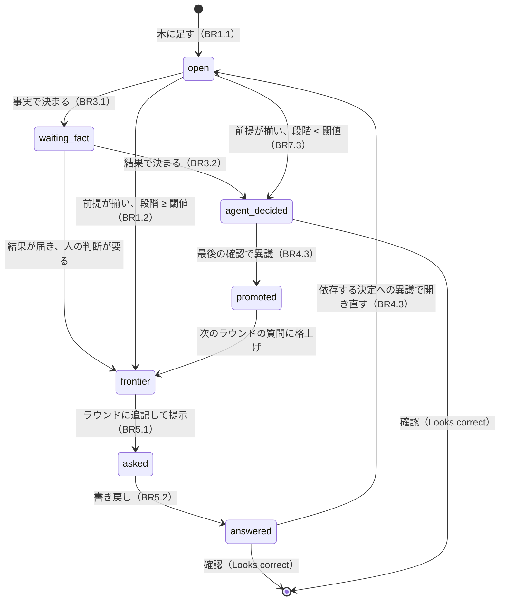
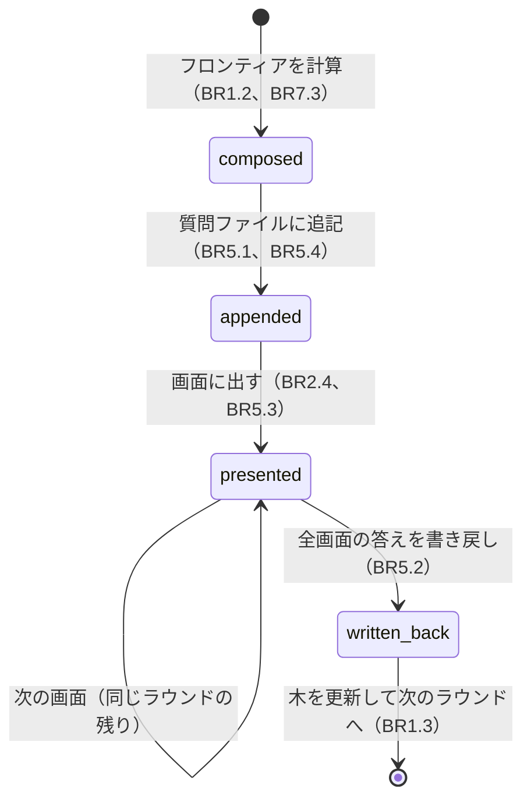
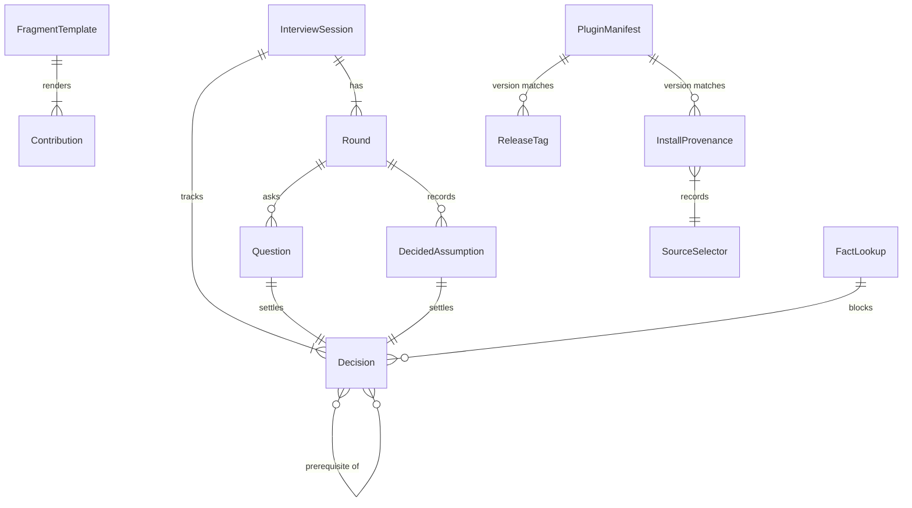

# 挙動仕様 — Grill me プラグイン計画の完了と取り込み元スキル現行版の取り込み

## 上流の入力

- 要求一覧: `../../inception/requirements-analysis/requirements.md`（FR1〜FR8、NFR1〜6、C1〜C7、OQ2〜OQ5）
- 構成決定: `../../inception/domain-design/components.md`（6 コンポーネント）、`decisions.md`（ADR-001〜008）
- 取り込み元スキルの逐語コピー: `../../inception/domain-design/upstream-grilling-SKILL.md`、`upstream-grilling-doc.md`
- 確認済み回答: `functional-design-questions.md`（Q1〜Q5 はすべて A。決めた前提 6 件）
- 存在しない入力（plugin-dev スコープの設計どおり。Unit を切らない単一の作業として進める）: `unit-of-work.md`、`unit-of-work-story-map.md`、`contract-summary.md`

本ファイルはワークフローと状態機械の正本である。エンティティの形は `entities.md`、決定のルールは `rules.md` が正本で、本ファイルの ER 図とルール要約はそこから派生した読み物。

## 概要

設計の対象は 3 つ。(1) Grill me の断片テンプレートが定める面接の進め方（決定の木 → ラウンド → 帳簿 → 共有理解の確認）。(2) インストーラとリリースツールの手順（参照先 deep-spec-analysis を写す）。(3) それらを検証するテストと、書く文書の項目。文書（CompletionRecord / DecisionRecord / LiveCheckRecord）にはルールも状態機械も持たせない（ADR-008）。

## ワークフロー（正本）

### WF1 — Grill me の面接（1 ステージ分）

前提: ステージが stage-protocol §3 Step 1 で質問ファイルを下書きし、Step 2 のモード選択で人が `Grill me` を選んだ。

1. モード選択の答えを §3 のとおり記録する（`aidlc-log.ts answer`）。
2. `aidlc-state.md` の `**Depth**` から人に聞く最小の段階（askThreshold）を決める（BR7.2: Minimal → L、Standard → M、Comprehensive → S）。`project.md` の `## Corrections` と会話中の指示から oneAtATime を決める（BR6.1、BR6.2）。
3. 下書きの質問を決定の木に写す。各決定に前提と段階（BR7.1、迷ったら大きい方 BR7.4）を付ける。答えが環境の事実で決まる決定は FactLookup にして調査を始め（BR3.1）、その決定を waiting-fact にする。
4. フロンティアを計算する（BR1.2）。前提が揃った決定のうち、段階が askThreshold 以上のものを今のラウンドの質問に、未満のものは推奨回答で決めて決めた前提にする（BR7.3）。FactLookup を待つ決定は入れない（BR3.3）。
5. ラウンドを質問ファイルに追記する（BR5.1）: ラウンドの見出し、各質問（番号・題・本文・選択肢・推奨と理由、空の `[Answer]:`）、調査待ちの質問には `**Pending:**` 行（BR3.2）、決めた前提の節（BR5.4）。質問が 0 件で決めた前提だけなら、節を追記して 4 へ戻る（画面は出さない）。
6. 画面に出す。Claude Code では 4 問ずつに分け（BR2.4、oneAtATime なら 1 問ずつ）、画面ごとに `aidlc-log.ts decision` → 構造化質問（推奨を先頭にして `(Recommended)`、BR2.2）→ 答えを `[Answer]:` に書き戻し `**Mode:** grill` を置く（BR5.2）→ `aidlc-log.ts answer`（BR5.3）。番号付きプローズでは ❓ / ➡️ / --- の書式で 1 ラウンドを 1 メッセージに出し（BR2.3）、番号で答えを受けて同じく書き戻す。最初の画面の前に「Other を選べば答える前に相談できる」と伝える（§3 Step 3a）。
7. 答えと届いた調査結果で木を更新し、フロンティアを計算し直す（BR1.3）。新しく見えた決定は木に足す（BR1.1）。調査結果で聞く必要がなくなった質問は `[Answer]: Resolved by lookup (round <n>)` と `**Mode:** grill` を書き、決めた前提に移す（BR3.2）。
8. フロンティアが空でなければ 4 へ。空になったら（BR4.1）9 へ。
9. 共有理解の確認（BR4.2）: 回答の要約（箇条書き）と決めた前提の全件（ラウンド順）を出し、`aidlc-review-brief.ts summary` の brief を印字し、`aidlc-log.ts decision --checkpoint summary-confirmation` を記録してから Looks correct / Request changes を聞く。成果物はまだ書かない。
10. Looks correct なら `aidlc-log.ts answer --checkpoint summary-confirmation` を記録し、Guide me と同じ合流点（成果物の生成）へ進む。Request changes なら異議の対象を聞き、決めた前提なら promoted にして次のラウンドの質問に格上げ、回答済みの質問ならその枝を開き直し（BR4.3）、4 へ戻る。

### WF2 — 事実の調査（WF1 の 3・7 から）

1. 調べる対象（ファイル、設定、前段の成果物、参照実装）と、その結果を待つ決定を特定する。
2. Claude Code ではサブエージェント（Task）に調べさせる。サブエージェントを呼べないハーネスでは自分で調べる（BR3.1）。
3. 調査中はラウンドを止めない。依存しない質問は先に出す（BR3.3）。
4. 結果が届いたら、依存する決定を waiting-fact から戻す: 人の判断が要るなら frontier（次のラウンドで聞く）、事実で決まるなら agent-decided（決めた前提に理由付きで書く）。

### WF3 — 1 問ずつへの切り替え（WF1 の 2・6 で）

1. Grill me の開始時に `project.md` の `## Corrections` を読み、「Grill me / grilling は 1 問ずつ」の趣旨の行があれば oneAtATime = true（BR6.1。日本語・英語いずれでも、完全一致は求めない）。
2. 面接中に人が 1 問ずつを求めたら、以後の画面を 1 問ずつにする（BR6.2）。`project.md` は書かず、永続化は §13 の学びの儀式に任せる。
3. 切り替えてもラウンドの計算・追記・決めた前提は変えない（BR6.3）。

### WF4 — インストーラの実行（`grilling/scripts/install.ts`）

1. 引数を検査する（BR8.1）: `--project` 必須、`--harness` 既定 claude、選択子は 1 つまで（BR8.2）、`--update` は選択子と併用不可（BR8.3）、`--dry-run`、`--skip-build`。
2. 選択子を解決する: `--from` → local、`--ref` → ref、`--tag` → tag、なし → latest（GitHub のタグ一覧から最新の安定 SemVer）。`--update` は provenance の source / ref を再利用し、source が tag なら `Changed 0` で終了（BR8.3）。
3. ソースを取得する: local はそのパスを使う。ref / tag / latest は GitHub のソースアーカイブ（tar.gz）を一時領域に取得し、パストラバーサルとリンクを拒否して展開する（BR8.5）。
4. manifest を検証する（BR8.4）: name = `grilling`、version が安定 SemVer、`--tag` なら tag = `v` + version。
5. `aidlc-plugin-build.ts` でハーネス投影を一時領域に生成する（`--skip-build` は既存の投影を使う）。
6. 候補のペイロードのダイジェストを計算し、provenance と比べる。同じ source / ref、同じ version、同じダイジェスト、廃止済みファイルなしなら `Changed 0` で終了（BR8.7）。
7. `--dry-run` なら計画（ハーネス、選択子、版、変更の有無）を表示して終了。対象には書かない（BR8.11）。
8. 置き直し（upgrade refresh）: 投影に sensors / tools / knowledge / agents / scopes / stages がないため 0 件（BR8.9）。
9. storeless 系（kiro / kiro-ide / cursor）は投影をプロジェクト直下へフォルダドロップする。store 系（claude / codex / copilot / opencode）は投影からそのまま compose する（BR8.8）。
10. `aidlc plugin sync` が使えればそれを、無ければ投影の `hooks/compose.ts` を環境変数付きで実行する（BR8.8）。すべての書き込みは `--project` の中に限り、symlink は追わない（BR8.6）。
11. 導入済みペイロードのダイジェストを計算し、provenance（5 項目）を一時ファイル + rename で書く（BR8.10）。
12. 完了案内を表示する（BR8.12）: Grill me が次の質問ステージのモード選択に 4 択目として現れること、エンジン更新後は `/aidlc plugin sync` を再実行すること。

エラーの扱い: 1〜4 の失敗は何も変更せずに非 0 で終了。5〜10 の失敗はその時点で止め、メッセージに失敗した段階と対象パスを含める。provenance は 10 が成功したときだけ書く（失敗した導入の provenance を残さない）。

### WF5 — リリースの実行（`grilling/scripts/release.ts <version>`）

1. 引数を検査する（BR9.1）: 1 つ、安定 SemVer。
2. 事前検査（BR9.2）: ブランチ `main`、clean な worktree、`v<version>` がローカルにもリモートにも存在しない。1 つでも落ちたら何も変更せず非 0 で終了。
3. `.aidlc-plugin/plugin.json` の version を更新する。
4. `chore(release): publish v<version>` でコミットする（`--allow-empty`）。
5. タグ `v<version>` を打つ。
6. `git push --atomic origin main v<version>`。途中で失敗したらそこで止めて非 0（BR9.3）。

git 操作は注入可能な関数で行い、テストは呼ばれた引数の列で検証する（BR9.5）。

### WF6 — CI のタグ検査（`.github/workflows/ci.yml`）

1. タグ push（`refs/tags/*`）のとき、通常のステップに加えて `bun grilling/scripts/release.ts --check-tag $GITHUB_REF_NAME` を実行する（BR11.1）。
2. tag が `v<stable semver>` でない、または manifest の version と一致しなければ非 0 で失敗（BR9.4）。

### WF7 — ライブ確認（`bun run test:live`、Claude Code のみ）

1. Claude 投影を build し、submodule の `dist/claude` を使い捨てプロジェクトに写して compose する（既存のとおり）。
2. Claude Agent SDK で `/aidlc --scope feature <小さな CLI の説明>` を流す。Depth は feature スコープの Standard（askThreshold = M）。
3. 画面 1（モード選択）で `Grill me` を選ぶ（BR10.3）。以後の画面は先頭の選択肢を選ぶ。
4. 画面 2: 2〜4 問、各質問の先頭が `(Recommended)`（BR10.4）。画面 3: 4 問以下、先頭が `(Recommended)`（BR10.5）。画面 3 の後で止める。
5. 帳簿を検査する（BR10.6）: 質問ファイルの `[Answer]:` と `**Mode:** grill`、監査記録の Options / QUESTION_ANSWERED / DECISION_RECORDED（3 件以上）。
6. 人が画面のログを読み、同じ画面の質問どうしが独立だったかを判断して `docs/live-check-<日付>.md` に書く（BR10.7）。

### WF8 — 文書の作成（Code Generation で）

順序は問わない。各文書に書く項目は BR12.1〜12.5 のとおり（「文書の項目」節に一覧）。

## 状態機械（正本）

### Decision（決定の木の節）


<!-- Text fallback: open →（事実で決まる）waiting_fact →（結果）frontier または agent_decided。open →（前提が揃い段階 ≥ 閾値）frontier →（追記・提示）asked →（書き戻し）answered。open →（前提が揃い段階 < 閾値）agent_decided。agent_decided →（異議）promoted → frontier。answered →（依存への異議）open。answered / agent_decided は Looks correct で終了。 -->

### Round（ラウンド）


<!-- Text fallback: composed →（追記）appended →（提示）presented →（同じラウンドの残りの画面を繰り返す）→（全画面の書き戻し）written_back → 木を更新して次のラウンド（composed）へ。 -->

InterviewSession は open →（フロンティアが空）frontier-empty →（Looks correct）confirmed。Request changes は frontier-empty → open に戻す。

## 決定の大きさの判定（BR7.1 の正本）

断片には英語で次の趣旨を書く（人に見せる文は会話言語で描画し、段階タグは固定）。日本語訳を併記する。

**英語の原文（断片に書く文）**

> Size every decision with two questions before deciding who answers it: **Reach** — if this flipped later, what else would change? **Undo** — how hard is it to reverse?
>
> - **XL** — changes the shape of the solution: a boundary, the architectural style, who owns the data. Ask: "Would reversing this redraw a boundary or reopen the design?" e.g. keeping the interview ledger in the questions file vs. a separate store. Not XL: which harness gets the first live check (M).
> - **L** — changes a component's responsibility or a contract between components. Ask: "Would another component's interface change if this flipped?" e.g. the installer running compose itself vs. leaving it to the user. Not L: the installer's default harness name (S).
> - **M** — user-visible behaviour inside one component: a rule, a workflow, what happens on error. Ask: "Would the user notice a different outcome, with no interface changing?" e.g. how many questions share one screen. Not M: the wording of the recommended-answer marker (S).
> - **S** — a local choice: a default, a name, a format, a threshold. Ask: "Could this be changed later in one place, in minutes, without telling anyone?" e.g. the provenance file name. Not S: whether provenance exists at all (L).
> - **SS** — a choice the user never sees. Ask: "Would the user notice at all?" e.g. the key order inside the provenance JSON. Not SS: the format of a decided-assumption line (S) — the user reads it.
>
> When two tiers both fit, take the larger one.

**日本語訳**

| 段階 | 何を変えるか | 判定の問いかけ | 例 | 反例 |
|---|---|---|---|---|
| XL | 解の形（境界・アーキテクチャ様式・データの所有者） | 「戻すと境界を引き直すか、設計を再承認するか？」 | 面接の帳簿を質問ファイルに置くか、別の保存先にするか | 最初のライブ確認をどのハーネスで行うか（M） |
| L | 構成要素の責務、または構成要素間の契約 | 「これが変わると他の構成要素のインターフェースも変わるか？」 | インストーラが compose まで行うか、利用者に任せるか | インストーラの既定のハーネス名（S） |
| M | 1 つの構成要素の中で利用者に見える挙動（ルール・ワークフロー・エラー時の扱い） | 「インターフェースは変わらないが、利用者は結果の違いに気づくか？」 | 1 画面に何問出すか | 推奨回答の印の文言（S） |
| S | 局所の選択（既定値・命名・書式・閾値） | 「あとで 1 か所を数分で、誰にも断らず変えられるか？」 | provenance のファイル名 | provenance を持つかどうか（L） |
| SS | 利用者に見えない選択 | 「利用者はそもそも気づくか？」 | provenance JSON の中のキーの順序 | 決めた前提の行の書式（S。利用者が読む） |

2 段階にまたがるときは大きい方（BR7.4）。

## Depth と人に聞く段階（BR7.2 の正本）

| Depth | 人に聞く | エージェントが決めて「決めた前提」に書く |
|---|---|---|
| Minimal | XL、L | M、S、SS |
| Standard | XL、L、M | S、SS |
| Comprehensive | XL、L、M、S | SS |

取り込み元の「質問数に上限を設けない」方針はそのまま（C7）。絞るのは数ではなく大きさで、閾値未満でも黙って決めることはない（必ず書いて一括確認する）。

## 質問ファイルの形

英語の会話での形（見出しは会話言語で描画。固定トークンは `[Answer]:`、`**Mode:** grill`、`**Pending:**`、`X. Other (please specify)`、段階タグ）。

```markdown
## Round 1

## Q1. <title>

<one line of context>

A. <option>
B. <option>
X. Other (please specify)

Recommended: B — <one-line reason>

[Answer]: B
**Mode:** grill

## Q2. <title>

<context>

A. ...
X. Other (please specify)

Recommended: A — <reason>

[Answer]:
**Pending:** whether the repo already has a CI workflow

### Decided assumptions (round 1)

- [S] Default output format is plain text — matches every other CLI in this repo
- [SS] Provenance keys are written in insertion order — nobody reads the raw JSON

## Round 2

## Q3. ...
```

日本語の会話では見出しを「## ラウンド 1」「### 決めた前提（ラウンド 1）」のように描画する（この記録の `functional-design-questions.md` がその例）。Claude Code の画面では推奨を先頭に置いて label に `(Recommended)` を付けるが、ファイルの選択肢の並びと文字は変えない。番号付きプローズでは同じ内容を `❓ **Q1** - **<title>**: ...` / `➡️ B — <reason>` / `---` の書式で 1 メッセージに出す。

## 文書の項目（ADR-008: ルールも状態機械も持たない）

| 文書 | 書く項目 | 出典 |
|---|---|---|
| `docs/plugin-plan.md`（完了記録） | 命名・配置・sync スクリプト・実アンカーの反映。§3 を新方式に差し替え。§8 / §10 の各項目に 済 / N/A / 残（N/A: §8-2、§8-5。残: 他 6 ハーネスの `--install`、番号付きプローズ系のライブ確認）。§9 に確定した 3 事実。成功指標 3 の証拠（`docs/live-check-2026-09-03.md` と新記録の所在と集計） | BR12.2 |
| ルート `README.md` / `README.ja.md` | 7 見出し。Install は `curl | bun -` に `--tag v0.2.0`。代替は Claude Code / Codex の store 経由。Adopting mid-project の 3 点。License 節から `LICENSE` を参照。相互リンク | BR12.3 |
| `LICENSE` | MIT、著作権者は参照先と同じ | ADR-006 |
| `grilling/docs/decisions.md` / `decisions.ja.md` | 7 件の決定＋NG1 の結果 | BR12.4 |
| `grilling/README.md` / `README.ja.md` | Install / Development / How the mode works を新方式・インストーラ・リリースに整合 | BR12.5 |
| `docs/live-check-<日付>.md` | ハーネス・モデル・ラウンド数・質問数・`**Mode:** grill` の件数・独立性を人が読んだ結果 | BR10.7 |
| `mise.toml` / `renovate.json` / `ci.yml` | bun 1.3.13、renovate の 3 規則、タグ検査ステップ | BR11.1〜11.3 |

## ER 図（`entities.md` からの派生）


<!-- Text fallback: FragmentTemplate 1 — 多 Contribution。InterviewSession 1 — 多 Round、1 — 多 Decision。Round 1 — 0..多 Question、1 — 0..多 DecidedAssumption。Question と DecidedAssumption はそれぞれ 1 つの Decision を決める。Decision は他の Decision を前提に持つ（多対多）。FactLookup は複数の Decision を待たせる。PluginManifest の version は InstallProvenance と ReleaseTag に一致する。InstallProvenance は SourceSelector（kind と value）を記録する。 -->

## ルール要約（`rules.md` からの派生）

| 群 | 要点 |
|---|---|
| BR1 | 決定の木、前提の揃った独立な質問だけを 1 ラウンドに、答えのたびに計算し直す |
| BR2 | 番号・題・本文・推奨（理由 1 行）。Claude Code は推奨先頭＋`(Recommended)`、他は ❓/➡️。4 問ずつ画面分割。4 択目の固定文 |
| BR3 | 聞かずに調べる。`**Pending:**` で先に追記。待たずに残りを出す |
| BR4 | フロンティアが空で終了。要約＋決めた前提の一括確認。異議は質問に格上げ |
| BR5 | 提示前に追記、受領次第書き戻し＋`**Mode:** grill`、画面ごとに記録、決めた前提の節 |
| BR6 | 1 問ずつ: Corrections の行を趣旨で判断、会話中の指示も受ける。計算と帳簿は変えない |
| BR7 | 2 つの問いかけで 5 段階。Depth → 閾値。未満は決めた前提。迷ったら大きい方 |
| BR8 | インストーラ: 引数・選択子・`--update`・manifest、アーカイブ安全性、境界、冪等、合成経路、provenance、dry-run、案内 |
| BR9 | リリース: 安定 SemVer、事前検査 4 種、更新→コミット→タグ→atomic push、`--check-tag`、git 注入、0.2.0 |
| BR10 | 検証: 既存検査、テンプレートのトークン、ライブ確認の画面 1〜3 と帳簿、記録、installer / release のテスト、15 分 |
| BR11 | CI のタグ検査、mise と CI の bun 版、renovate の 3 規則 |
| BR12 | 文書の内容: ja/en 対、完了記録、ルート README、decisions、プラグイン README |

## 断片の長さ（ADR-004 のプロンプト予算）

テンプレートは 150 行以内（現行は 43 行）。新方式で増える内容はラウンドの規則（BR1）、書式と分割（BR2）、調査（BR3）、終了と確認（BR4）、帳簿（BR5）、切り替え（BR6）、5 段階と Depth 表と決めた前提の書式（BR7、BR5.4）で、英語の原文で 100〜120 行の見込み。テンプレート検査（BR10.2）が上限を検査する。

## 決めた前提（挙動設計でエージェントが決めた S 以下の決定）

- [S] 4 択目の description は「Interview me in rounds of independent questions, each with a recommended answer; drill into every branch until we share the same understanding」（BR2.5） — 旧文の one question at a time を新方式に合わせた 1 文
- [S] 調査結果で不要になった質問の `[Answer]:` は `Resolved by lookup (round <n>)`（BR3.2） — 空欄を残さず、最後の確認で全問が埋まった状態にする
- [S] 迷ったら大きい方（BR7.4） — 質問を減らす側に倒さない
- [S] ラウンドと決めた前提の見出しは会話言語（固定トークンではない） — `## Consolidated Summary Confirmation` のようなプロトコルの見出しと違い、ツールが読まない。テストが読むのは `**Mode:** grill` と `(Recommended)` だけ
- [S] テンプレートの行数上限 150（BR10.2 で検査） — ADR-004 の「プロンプト予算への影響は挙動設計で測る」への答え
- [S] ライブ確認は画面 3 の後で止める（現行と同じ `stopAfterAskUserQuestionAt: 3`） — ラウンド 1 の分割または ラウンド 2 の先頭まで見えれば十分

## 上流との対応

- 要求 FR1〜FR8 の各項目は `traceability.json` で BR に対応づけた。FR7 は要求一覧で NG1 に移動しているため N/A。
- 構成決定 ADR-001（インストーラは写す）→ WF4、BR8。ADR-002 → WF5、WF6、BR9。ADR-004（定義は断片の中）→ FragmentTemplate の属性と BR10.2 の行数上限。ADR-005（opt-in）→ BR10.10。ADR-007 → BR8.12。ADR-008 → 文書はルールなし（BR12 は内容の方針）。
- 取り込み元スキル（design tree / frontier / rounds / ❓➡️ / facts by sub-agent / done when frontier empty + confirm）→ BR1〜BR4 に 1 対 1。取り込み元の「質問数に上限なし」は C7 のとおり大きさで絞る方式に置き換え（BR7）。取り込み元の「one question at a time」の opt-out → BR6。
- 要求整理の OQ2（更新時の置き直し）→ BR8.9。OQ3（Adopting mid-project）→ BR12.3。OQ4（判定文）→ BR7.1 と本ファイルの正本。OQ5（ラウンドの検証）→ BR10.4、BR10.5、BR10.7。

## Review

**Verdict:** READY
**Reviewer:** aidlc-architecture-reviewer-agent
**Date:** 2026-09-04T09:38:24Z
**Iteration:** 1

### Findings

| ID | Severity | Location | Finding | Required action | Status |
|---|---|---|---|---|---|
| R-01 | Minor | rules.md > BR12.1〜BR12.5（`applies_to: [DocumentationSet]`） | ADR-008 は「Functional Design で `CompletionRecord` / `DecisionRecord` / `LiveCheckRecord` にビジネスルールやライフサイクルを定義しない」と定めている。entities.md はこの 3 エンティティを正しく載せていないが、rules.md の BR12.1〜12.5 は `trigger` / `logic`（IF…THEN）/ `violation` というルール専用の形式を `DocumentationSet` に対して使っており、内容（BR12.2 は計画書＝CompletionRecord の内容、BR12.4 は decisions＝DecisionRecord の内容）は実質的にこれら 3 エンティティの「書く項目」を規定している。状態機械は無く実害は小さいが、rules.md の YAML 正本のフィールド形式そのものが ADR-008 の意図した「ルールではなく方針として書く」という区別を薄めている。 | 次回改訂時に BR12 を rules.md の `id: BRx.y` 形式から外し、functional-spec.md の「文書の項目」表（既にある）だけを正本にするか、`trigger`/`logic`/`violation` を持たない別形式（例: `policy` 専用の軽量スキーマ）にする。Blocking ではない。 | New |
| R-02 | Minor | entities.md > InstallProvenance vs `../../inception/domain-design/components.md` > Entity Ownership 表（InstallProvenance 行） | components.md（Entity Ownership）は InstallProvenance の属性を `path, version, sourceKind, sourceSelector, installedAt, payloadDigest, harness` の 7 項目としているが、entities.md は `path, version, ref, source, installed_at, payload_sha256` の 6 項目で `harness` を持たない（質問ファイルの「決めた前提」で意図的に決定・理由あり）。設計判断としては妥当だが、upstream の components.md 側は未更新のまま残っており、両ファイルを付き合わせると読者は矛盾に見える。 | components.md の Entity Ownership 表（InstallProvenance 行）を functional-design の確定形（6 項目、harness 除外）に合わせて更新するか、少なくとも entities.md 側にも「components.md の初期案からの変更点」として一言参照を足す。Blocking ではない。 | New |

### Validation Tool Results

| Tool | Result | Interpretation |
|---|---|---|
| traceability（`aidlc-sensor-traceability.ts`） | `{"pass":false,...,"reason":"cannot derive the construction unit from output path"}` | このワークフローは Unit を切らない plugin-dev スコープのため、成果物がステージ直下にあり、センサーがユニットを特定できずに構造チェックへ進めない（フレームワーク側の既知の制約）。ブリーフの指示どおり、BR 実在チェックと孤児チェックを手作業（grep）で代替した：`rules.md` に BR1.1〜BR12.5 の全 68 件が実在し、`traceability.json` の `coverage[].target` に現れる BR は全件 `rules.md` に存在、逆に `rules.md` の全 68 BR は `coverage[].target` のいずれかに現れる（孤児なし、`reverse: []` は妥当）。 |
| linter / type-check | 対象コード断片なし | `entities.md` / `rules.md` は ```yaml のみ、`functional-spec.md` は ```mermaid（3 件、いずれもテキストフォールバック付き）と質問ファイルの書式例（```markdown、コードではない）のみで、JS/TS 断片は皆無。ステージ制約（設計段階・コードは擬似コードのみ）を満たす。 |

### Summary

相互参照はすべて解決する: `traceability.json` の 38 件の FR 項目（FR7 は要求一覧で NG1 に改番済みのため N/A として正しく処理）はすべて `rules.md` 実在の BR1.1〜BR12.5（68 件）を指し、孤児 BR も宙に浮いた参照もない。取り込み元スキルの 5 要素（決定の木・ラウンド・❓➡️・待たない事実調査・フロンティア空で終了＋確認）は BR1〜BR4 に忠実に移され、C3（Claude Code 4 問 4 択）・C7（数ではなく大きさで絞る）とも整合している。OQ4（5 段階の判定文）は BR7.1 と「決定の大きさの判定」節で、OQ5（ラウンドの検証）は BR10.4／BR10.5／BR10.7 で解消済みで、Q1〜Q5 の確認済み回答（すべて A）と一致している。2 つの mermaid 状態機械（Decision、Round）はすべての状態が到達可能で行き止まりがなく、テキストフォールバックも付いている。ADR-008（文書エンティティにルール・状態機械を持たせない）は entities.md では守られているが、rules.md の BR12 がルール専用の YAML 形式（trigger/logic/violation）を DocumentationSet に対して使っている点（R-01）と、entities.md の InstallProvenance が上流 components.md の属性リストと（正当な理由付きで）食い違ったままである点（R-02）は、いずれも Minor（設計の実装可能性やドメインモデルの整合性を損なわない）にとどまるため、Critical/Major はゼロで READY と判定する。
