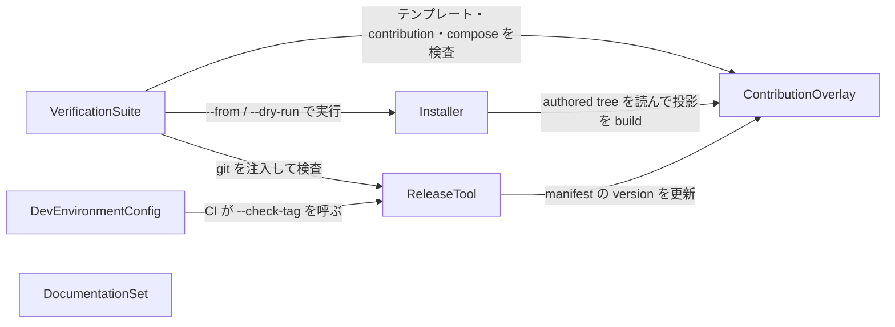

# コンポーネント一覧 — Grill me プラグイン計画の完了と取り込み元スキル現行版の取り込み

要求一覧（`../requirements-analysis/requirements.md`、FR1〜FR8）を実現する論理的な構成要素を定める。既存構造の把握で得た知識ベース（`aidlc/spaces/default/codekb/aidlc-workflows/architecture.md` の「validate → build/emit → install → compose/sync → recompile」の流れと、`component-inventory.md` のエンジン側コンポーネント）は、ここでは各コンポーネントの `external_dependencies` として現れる。エンジン側のコンポーネント（Plugin Validator、Plugin Build CLI、Compose Hook Template など）はこのプラグインが書くコードではないため、catalogue には含めない。

## Part A — 機械可読の catalogue

```yaml
components:
  - name: ContributionOverlay
    summary: Grill me モードを 28 のコアステージへ差し込む断片（contribution）と、その唯一の原本であるテンプレート、drift guard
    behaviour: >
      28 の contribution はすべて同一のテンプレート（tests/fragment-template.md）を target と anchor だけ変えて描画したもので、
      scripts/sync-contributions.ts が生成と一致検査（--check）を行う。テンプレートは Grill me の全仕様を自己完結で持つ:
      モード選択の 4 択目（label と description）、決定の木とフロンティアをラウンドで出す規則、質問の書式（番号付きプローズ系は
      ❓/➡️、Claude Code は (Recommended) 先頭）、Claude Code の 4 問制限による画面分割、事実は調べさせるか自分で調べて待たない規則、
      フロンティアが空になったら consolidated summary で共有理解を確認する規則、質問ファイルへの追記と書き戻し（**Mode:** grill）と
      decision/answer の記録、project.md の Corrections による 1 問ずつへの切り替え、決定の大きさ 5 段階（XL/L/M/S/SS）と Depth の対応、
      閾値以下の決定を「決めた前提」として書く形式。プラグインは contributions のみ（stages / agents / scopes / sensors / tools / knowledge を持たない）。
      manifest（.aidlc-plugin/plugin.json）はこのコンポーネントが所有する。
    responsibilities:
      - Grill me モードの仕様（FR8.1〜FR8.7）をテンプレート 1 本に記述する
      - テンプレートから 28 contribution を生成し、drift を検査する
      - manifest（name / version / description / contributes.overlays）を所有する
    depends_on: []
    dependents:
      - component: Installer
        interaction: プラグインの authored tree（manifest と contributions）を読んでハーネス投影を build する
      - component: ReleaseTool
        interaction: manifest の version を更新する
      - component: VerificationSuite
        interaction: テンプレートと contribution の内容・アンカー・compose 結果を検査する
    external_dependencies:
      - name: aidlc-workflows compose hook（hooks/compose.ts）
        kind: other
        purpose: インストール先で contribution をコアステージへマージし、グラフを再コンパイルする
      - name: aidlc-plugin-validate.ts
        kind: other
        purpose: manifest と contribution の target / plugin を検査する
    entities:
      - name: FragmentTemplate
        identifier: path
        attributes: [path, modeLabel, modeDescription, roundRules, renderingRules, screenSplitRule, factFindingRule, terminationRule, ledgerRules, optOutRule, decisionSizeTiers, depthThresholds, decidedAssumptionsFormat]
      - name: Contribution
        identifier: target
        attributes: [phase, target, anchor, order, fragmentBody]
        references:
          - entity: FragmentTemplate
            owned_by: ContributionOverlay
            relationship: 各 Contribution の fragmentBody は FragmentTemplate を描画したもの
      - name: PluginManifest
        identifier: path
        attributes: [path, name, version, description, contributes]

  - name: Installer
    summary: 1 コマンドで対象の AI-DLC プロジェクトへ導入する scripts/install.ts
    behaviour: >
      --project を必須とし、--harness（既定 claude）、ソース選択子（--tag / --from / --ref、なければ最新の安定 SemVer タグ）、--update、--dry-run を受ける。
      ソースを取得（GitHub のソースアーカイブまたはローカル checkout）→ manifest の name と version を検証 → aidlc-plugin-build.ts でハーネス投影を生成 →
      store 系ハーネスは dist/ から直接 compose、storeless 系はプロジェクト直下へフォルダドロップしてから compose → aidlc plugin sync があればそれを、
      無ければ投影の hooks/compose.ts を実行 → provenance を書く → 「次の質問ステージで Grill me が 4 択目に現れる」ことと
      「エンジン更新後は /aidlc plugin sync を再実行する」ことを表示する。symlink は追わず、--project の外へは書かず、認証情報を扱わない。
      参照先 deep-spec-analysis の install.ts を写し、定数（プラグイン名 / リポジトリ / provenance ファイル名）と deep-spec 固有の後処理だけを差し替える。
    responsibilities:
      - ソースの取得と検証（タグ / ブランチ / ローカル）
      - 投影の build と compose の実行（冪等）
      - provenance の記録と完了案内の表示
    depends_on:
      - component: ContributionOverlay
        interaction: authored tree（manifest と contributions）を読んで投影を build する
        style: sync
    dependents:
      - component: VerificationSuite
        interaction: --from と --dry-run で実行し、冪等性と provenance を検査する
    external_dependencies:
      - name: aidlc-plugin-build.ts
        kind: other
        purpose: ハーネス投影の生成
      - name: GitHub ソースアーカイブ API
        kind: third-party-api
        purpose: --tag / --ref / latest のソース取得
      - name: aidlc plugin sync または hooks/compose.ts
        kind: other
        purpose: 対象プロジェクトへの合成
    entities:
      - name: InstallProvenance
        identifier: path
        attributes: [path, version, sourceKind, sourceSelector, installedAt, payloadDigest, harness]
        references:
          - entity: PluginManifest
            owned_by: ContributionOverlay
            relationship: InstallProvenance の version は導入した PluginManifest の version と一致する

  - name: ReleaseTool
    summary: バージョン更新・コミット・タグ・push を 1 コマンドで行う scripts/release.ts と、CI のタグ検査
    behaviour: >
      安定 SemVer のみ受け付け、main ブランチ・clean な worktree・ローカルとリモートにタグ未存在を事前検査してから、
      .aidlc-plugin/plugin.json の version を更新し、英語のコミットメッセージ「chore(release): publish vX.Y.Z」でコミットし、vX.Y.Z タグを打ち、
      main とタグを atomic に push する。--check-tag <tag> はタグと manifest の version の一致だけを検査し、CI がタグ push 時に呼ぶ。
      git 操作は注入可能にしてテストする。参照先 deep-spec-analysis の release.ts を写す。
    responsibilities:
      - リリースの事前検査と manifest の version 更新
      - コミット・タグ・push
      - タグと manifest の一致検査（--check-tag）
    depends_on:
      - component: ContributionOverlay
        interaction: manifest の version を更新する
        style: sync
    dependents:
      - component: VerificationSuite
        interaction: git 操作を注入して事前検査と mutation を検査する
      - component: DevEnvironmentConfig
        interaction: CI がタグ push 時に --check-tag を呼ぶ
    external_dependencies:
      - name: git
        kind: other
        purpose: コミット・タグ・push
    entities:
      - name: ReleaseTag
        identifier: tag
        attributes: [tag, version, commitMessage]
        references:
          - entity: PluginManifest
            owned_by: ContributionOverlay
            relationship: ReleaseTag の version は PluginManifest の version と一致しなければならない

  - name: VerificationSuite
    summary: grilling/tests/ のテスト群と、選択キー環境の opt-in 確認
    behaviour: >
      既存の plugin.test.ts（validate、contributions-only、target 集合、テンプレート一致、anchor 解決、7 ハーネス build、Claude / Kiro への compose、
      aidlc-plugin-test.ts）と live-claude.test.ts（Agent SDK で Claude Code を実走）を FR8 の新方式に更新する: メニュー 1 は 4 択、
      Grill me 選択後は「1 回の画面に前提の揃った質問がまとまって出る（4 問まで）」「推奨選択肢が先頭」「質問ファイルに **Mode:** grill と決めた前提」
      「監査記録に decision/answer」。installer.test.ts（--from、--dry-run、2 回目の冪等性、provenance）、release.test.ts（SemVer 検査、事前検査、
      manifest 更新、git 注入）を新設する。選択キー環境の確認は環境変数で有効化する opt-in テストとして置き、結果は記録のみ（受け入れ基準にしない）。
      CI の timeout 15 分内に収める。
    responsibilities:
      - 断片・投影・compose の検査（既存）
      - Installer と ReleaseTool の検査（新設）
      - Claude Code のライブ確認（opt-in）と選択キー環境の確認（opt-in、記録のみ）
    depends_on:
      - component: ContributionOverlay
        interaction: テンプレートと contribution を読み、compose 結果を検査する
        style: sync
      - component: Installer
        interaction: 使い捨てプロジェクトへ --from で導入して検査する
        style: sync
      - component: ReleaseTool
        interaction: git 操作を注入して検査する
        style: sync
    dependents: []
    external_dependencies:
      - name: bun test
        kind: other
        purpose: テストランナー
      - name: aidlc-workflows dist/<harness>
        kind: other
        purpose: compose テストとライブ確認の使い捨て install の元
      - name: Claude Agent SDK
        kind: third-party-api
        purpose: ライブ確認（opt-in）
    entities: []

  - name: DocumentationSet
    summary: ルート README（ja / en）、LICENSE、プラグイン README（ja / en）、計画書の完了記録、decisions（ja / en）、ライブ確認記録
    behaviour: >
      ルート README は参照先と同じ構成（Highlights / Quickstart / Development / Repository layout / Documentation / Getting help / License）で、
      Quickstart は Installer の curl | bun - 手順と host plugin store の代替を示す。LICENSE は MIT。プラグイン README は Install / Development /
      How the mode works を Installer・ReleaseTool・FR8 と整合させる。docs/plugin-plan.md は実装に合わせて更新し、§8 / §10 の各項目に済 / N/A / 残を付け、
      §3 を新方式に差し替え、§9 を確定事実で更新した完了記録にする。grilling/docs/decisions.md（ja / en）に決定を記録する。
      新方式のライブ確認記録を docs/ に日付付きで残し、旧記録は保持する。すべての新設文書は ja / en の対で内容を一致させる。
    responsibilities:
      - 利用者向け文書（README・LICENSE）
      - 完了記録（計画書）と決定記録（decisions）
      - ライブ確認記録の保管
    depends_on: []
    dependents: []
    external_dependencies: []
    entities:
      - name: CompletionRecord
        identifier: path
        attributes: [path, itemStatuses, driftNotes, riskTable, modeSpecRevision]
      - name: DecisionRecord
        identifier: decisionId
        attributes: [decisionId, title, decision, rationale, date, language]
      - name: LiveCheckRecord
        identifier: path
        attributes: [path, date, harness, method, roundsObserved, questionsObserved, modeMarkerCount]

  - name: DevEnvironmentConfig
    summary: mise.toml、renovate.json、CI ワークフロー（タグ検査ステップを含む）
    behaviour: >
      mise.toml で bun を CI と同じ 1.3.13 に固定する。renovate.json は config:recommended に bun ランタイムと @types/bun の同時更新、
      GitHub Actions の一括 PR を加え、ソルバー固定などこのリポジトリに無い規則は持ち込まない。CI（.github/workflows/ci.yml）は既存のステップに、
      タグ push 時の release.ts --check-tag を加える。
    responsibilities:
      - ツールチェーンの版固定と依存更新の自動化
      - CI にリリースのタグ検査を組み込む
    depends_on:
      - component: ReleaseTool
        interaction: タグ push 時に --check-tag を呼ぶ
        style: sync
    dependents: []
    external_dependencies:
      - name: GitHub Actions
        kind: other
        purpose: CI の実行
      - name: Renovate
        kind: third-party-api
        purpose: 依存更新 PR
    entities: []
```

## Part B — 人が読む view

### Component Diagram


<!-- Text fallback: Installer, ReleaseTool, VerificationSuite の 3 つが ContributionOverlay に依存する。VerificationSuite はさらに Installer と ReleaseTool に依存し、DevEnvironmentConfig（CI）は ReleaseTool の --check-tag を呼ぶ。DocumentationSet は呼び出し関係を持たない独立ノード。循環はない。 -->

### Component Summary

| Component | Purpose | Depends On | Dependents | Entities Owned |
|---|---|---|---|---|
| ContributionOverlay | Grill me の断片 28 本とテンプレート、drift guard、manifest | — | Installer, ReleaseTool, VerificationSuite | FragmentTemplate, Contribution, PluginManifest |
| Installer | 1 コマンド導入（取得・build・compose・provenance・案内） | ContributionOverlay | VerificationSuite | InstallProvenance |
| ReleaseTool | version 更新・コミット・タグ・push、--check-tag | ContributionOverlay | VerificationSuite, DevEnvironmentConfig | ReleaseTag |
| VerificationSuite | テスト群（既存の更新＋installer / release の新設）、opt-in 確認 | ContributionOverlay, Installer, ReleaseTool | — | — |
| DocumentationSet | README（ja/en）、LICENSE、完了記録、decisions、ライブ確認記録 | — | — | CompletionRecord, DecisionRecord, LiveCheckRecord |
| DevEnvironmentConfig | mise.toml、renovate.json、CI（タグ検査） | ReleaseTool | — | — |

### Entity Ownership

| Entity | Owning Component | Identifier | Attributes | References |
|---|---|---|---|---|
| FragmentTemplate | ContributionOverlay | path | path, modeLabel, modeDescription, roundRules, renderingRules, screenSplitRule, factFindingRule, terminationRule, ledgerRules, optOutRule, decisionSizeTiers, depthThresholds, decidedAssumptionsFormat | — |
| Contribution | ContributionOverlay | target | phase, target, anchor, order, fragmentBody | FragmentTemplate（描画元） |
| PluginManifest | ContributionOverlay | path | path, name, version, description, contributes | — |
| InstallProvenance | Installer | path | path, version, sourceKind, sourceSelector, installedAt, payloadDigest, harness | PluginManifest（version が一致） |
| ReleaseTag | ReleaseTool | tag | tag, version, commitMessage | PluginManifest（version が一致） |
| CompletionRecord | DocumentationSet | path | path, itemStatuses, driftNotes, riskTable, modeSpecRevision | — |
| DecisionRecord | DocumentationSet | decisionId | decisionId, title, decision, rationale, date, language | — |
| LiveCheckRecord | DocumentationSet | path | path, date, harness, method, roundsObserved, questionsObserved, modeMarkerCount | — |

### External Dependencies

| Component | Dependency | Kind | Purpose |
|---|---|---|---|
| ContributionOverlay | aidlc-workflows compose hook（hooks/compose.ts） | other | インストール先での合成と再コンパイル |
| ContributionOverlay | aidlc-plugin-validate.ts | other | manifest と contribution の検査 |
| Installer | aidlc-plugin-build.ts | other | ハーネス投影の生成 |
| Installer | GitHub ソースアーカイブ API | third-party-api | タグ / ブランチ / latest のソース取得 |
| Installer | aidlc plugin sync または hooks/compose.ts | other | 対象プロジェクトへの合成 |
| ReleaseTool | git | other | コミット・タグ・push |
| VerificationSuite | bun test | other | テストランナー |
| VerificationSuite | aidlc-workflows dist/<harness> | other | 使い捨て install の元 |
| VerificationSuite | Claude Agent SDK | third-party-api | ライブ確認（opt-in） |
| DevEnvironmentConfig | GitHub Actions | other | CI の実行 |
| DevEnvironmentConfig | Renovate | third-party-api | 依存更新 PR |

### Rationale

| Component | なぜ独立した構成要素か | 備考 |
|---|---|---|
| ContributionOverlay | 配布物そのもの。変更の理由が「Grill me の仕様」に閉じ、他の要素はこれを読むだけ | FR8 で中身が変わるが、単一テンプレート＋28 描画という構造は変えない（Q7=A、C1） |
| Installer | 変更の理由が「導入手順」に閉じ、参照先の設計を写せる独立したスクリプト | Q1=A。ReleaseTool と 1 ファイルに統合する案は却下（ADR-001） |
| ReleaseTool | 変更の理由が「リリース手順」に閉じ、CI からも呼ばれる | Q3=A（ADR-002） |
| VerificationSuite | 他の 3 要素を検査する側で、変更率が最も高い | 既存テストの更新と新設テストを 1 つの責務にまとめる |
| DocumentationSet | 人が読む成果物で、コードとは変更率も承認経路も異なる | 呼び出し関係は持たせず、Installer / ReleaseTool の契約を「記述する」対象として扱う（ADR-008）。挙動設計では CompletionRecord / DecisionRecord / LiveCheckRecord にビジネスルールやライフサイクルを定義しない（文書の項目を決めるだけ） |
| DevEnvironmentConfig | ツールチェーンの版と CI の設定は、コードとは別の理由（更新・環境）で変わる | mise / renovate / CI の 3 ファイル |

**代替案の検討（Alternatives Rejected）**: (1) Installer と ReleaseTool を 1 本の `scripts/plugin-cli.ts` に統合する案 — 参照先と構成が変わり「同等」の判定が難しくなるため却下（ADR-001）。(2) FR8 の定義を `knowledge/` に分離する案 — manifest に `knowledge` を足す必要があり contributions のみ（C1）を崩すため却下（ADR-004）。(3) 文書と設定を catalogue に載せない案 — FR2・FR3・FR6 の追跡先が無くなるため却下（ADR-008）。

## 上流との対応

- 要求一覧: FR1〜FR8 の各項目は `traceability.json` で上記のコンポーネント / エンティティに対応づけた。
- 知識ベース `architecture.md`: Installer の動作（取得 → build → compose → recompile）は「Data Flow」3〜4 と「Interaction Diagrams」トランザクション 1 を写したもの。`after-questions` 未実装（D4 / Improvement 1）は ContributionOverlay の anchor 選定の制約として残る。
- 知識ベース `component-inventory.md`: Plugin Validator / Plugin Build CLI / Compose Hook Template / Plugin Compose Test CLI は、このプラグインの external_dependencies として現れるエンジン側コンポーネント。

## Review

**Verdict:** READY
**Reviewer:** aidlc-architecture-reviewer-agent
**Date:** 2026-09-04T08:48:46Z
**Iteration:** 1
**Request Challenge:** review:38ee6f19181e44277506b1f9186007cb

### Findings

| ID | Severity | Location | Finding | Required action | Status |
|---|---|---|---|---|---|
| R-01 | Major | `components.md` > Part A の `DocumentationSet` / `DevEnvironmentConfig` コンポーネント、`decisions.md` > ADR-008 | ステージ定義の component 定義（「code you write, not infrastructure you deploy」）に対し、`DocumentationSet`（`depends_on: []` / `dependents: []`）と `DevEnvironmentConfig` はいずれもコードを書かず、グレーゾーンの意図的なトレードオフである。今回の改訂で ADR-008 の Consequences に「制約: `DocumentationSet` と `DevEnvironmentConfig` は書くコードではないため、Functional Design で `CompletionRecord` / `DecisionRecord` / `LiveCheckRecord` にビジネスルールやライフサイクル（状態機械）を定義しない」という明示的な歯止めが追加され、`components.md` の Rationale 表（DocumentationSet 行）にも同じ制約が転記された。決定そのもの（catalogue にコンポーネントとして載せる）は変更されておらず、人はゲートでこのトレードオフを承認済みという前提でこの再レビューが行われている。定義との逸脱自体はグレーゾーンのまま残るが、後続ステージが誤ってエンティティ扱いする実害は今回の追記で塞がれた。 | 追加対応なし。再ゲートでこの ADR-008 の制約が反映されたことを確認のうえ承認する。 | Accepted risk |
| R-02 | Minor | `domain-design-questions.md` > Q5 見出しと選択肢 E、`decisions.md` > ADR-005 Context | Q&A ファイルの確認済み回答は書き換えない制約（要約確認ダイジェストが壊れるため）があり、`FR7` の旧表記はそのまま残る。今回の改訂では ADR-005 の Context に「`domain-design-questions.md` の Q5 は下書き時点の番号 `FR7` のままだが、確認済み回答は書き換えないため表記はそのままであり、確定稿の要求では `NG1` に改番されている。本 ADR と `traceability.json` は `NG1` で扱う」という注記が追加され、`traceability.json` にも `FR7` を `status: "N/A"` として `NG1` への移行理由を明記する行が加わった。これにより、後続ステージが `decisions.md` や `traceability.json` を読む限り FR7→NG1 の対応関係を正しく追跡でき、Q&A ファイル側の旧表記による混乱は実質的に解消された。 | 追加対応なし。 | Resolved |
| R-03 | Minor | `decisions.md` > ADR-001 | Installer はソースアーカイブの取得・展開・対象プロジェクトへの書き込みを行う、セキュリティ境界に触れる主要決定であり、Inception フェーズガードレールは主要な建築決定にセキュリティ含意の明記を求める。今回の改訂で ADR-001 に **Security implications** の項が新設され、(1) tar.gz 展開時のパストラバーサル・リンク拒否、(2) `--project` 外への非書き込み・symlink 非追従、(3) 認証情報を扱わず公開アーカイブ API のみ使用、という 3 点の防御が明記され、NFR6（安全性）・NFR5（再現性）・FR4.4 のテストへの参照も付いた。フォルダドロップ経路の README 警告にも言及がある。要求されていたセキュリティ含意の明記は満たされた。 | 追加対応なし。 | Resolved |

### Validation Tool Results

| Tool | Result | Interpretation |
|---|---|---|
| required-sections | (未実行 — 本パスでは stage 定義に列挙されたセンサーのうちファイル内容の目視確認で代替) | `components.md` は Part A / Part B / Rationale / 上流との対応の各見出しを維持しており、構造上の欠落はない |
| upstream-coverage | (未実行 — traceability.json を目視検査) | `upstream_ids` は FR1〜FR8（枝番含む）を全て列挙し、`coverage` も同数の行を持つ。網羅に欠落なし |
| traceability | (未実行 — traceability.json を目視検査) | `FR7` は `status: "N/A"` で `NG1` への移行理由が記載されており、ディスパッチブリーフの「センサーは今回 pass を報告」という記述と整合する |

### Summary

前回指摘した R-01（グレーゾーンのコンポーネント定義逸脱、人の承認事項として受容）、R-02（Q&A 旧番号表記、ADR 側の注記で追跡可能に）、R-03（ADR-001 のセキュリティ含意欠落）はいずれも今回の改訂で手当てされており、新たな Critical / Major 所見もない。READY と判定する。
